# DITA_Learning
This repository provides insight into DITA, its core concepts and principles, and why it is important in technical documentation.
## What does DITA Stand for?
  - **Darwin:** DITA uses the principles of inheritance for specialization
  - **Information Typing:** DITA is designed for topic-based technical information based on an information architecture of concept, task, and reference
  - **Architecture:** DITA provides the framework for the development of an Information Model
## What is DITA exactly?
An XML architecture and semantic markup language specifically designed by technical writers for creating structured, technical content.
## Why DITA?
  - Industry-accepted architecture
  - Open standards
  - Active user community
  - Topic-based approach
  - Separation of form from content
  - Meaningful, semantic tagging
  - Conditional processing
  - Indirect and direct referencing of content
  - Inheritance of attributes and metadata
## What does the DITA model contain?
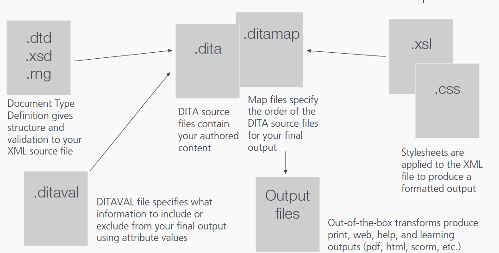
## What does the DITA model contain?
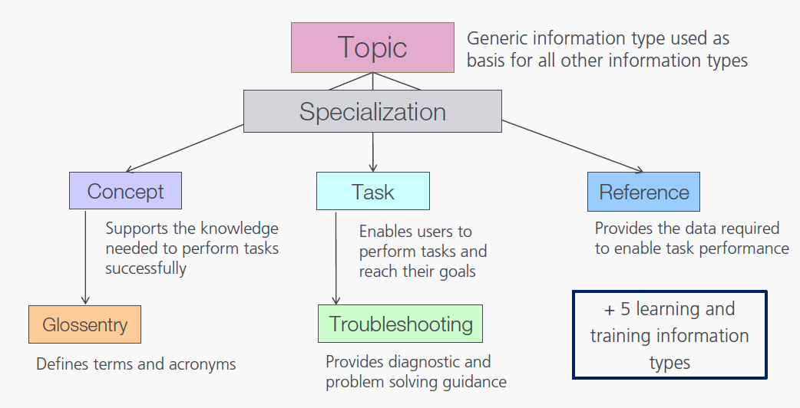
### What does the DITA model contain?
- A set of content units (elements)
  - Generic elements, valid in all information types
  - Information-type specific elements
  - Domain-specific elements
  - Book-specific elements
## What are content units?
  - The core building blocks of the information types
  - Semantic labels for the smallest chunks of information in your topic
  - Containers for text, graphics, or other media
  - Architectural files specify which are required and in what order for each information type
  - Stylesheets specify how they are formatted
# Semantic vs syntactic markup
## Semantic
 - Describes what each element in a document is
 - Does not provide information on how to process those elements
 - Is used to structure your information
## Syntactic
 - Describes the format for processing text and images
 - Prepares content for presentation (web, paper, etc.)
### Syntactic markup example
**Example 1**
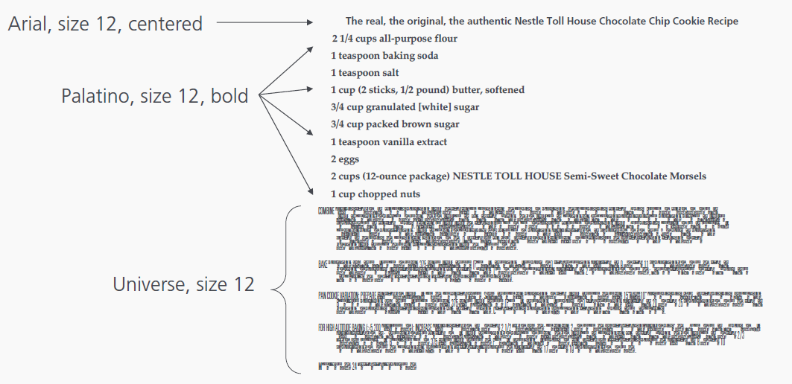
**Example 2**
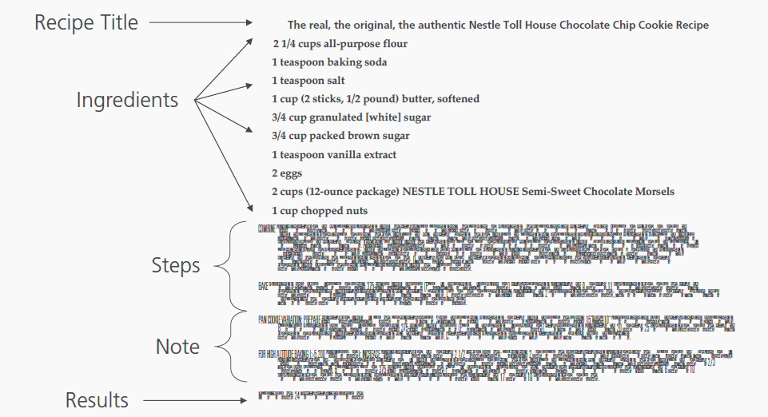
## Semantic labels
| Semantic | Syntactic |
|---|---|
| Task title | Heading 2 |
| Basic steps | Text box |
| Detailed step | Heading 3 |
|   - Instruction |  - Paragraph |
|   - Explaination | - Paragraph |
|   - Decision table | - Table |
|   - Example | - Graphic |
| Detailed step | - Graphic |
|   Instruction | Heading 3..|
## What does the DITA model contain?
**Blocked elements**
- Common to all information types
  - Paragraphs
  - Lists
  - Notes
  - Tables
  - Figures
    
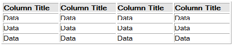

- Information-type specific
  - Task: Context, Preresquisite, Steps, Postrequisite
  - Reference: Refsyn, Properties
  - Troubleshooting: Condition Cause, Remedy
    
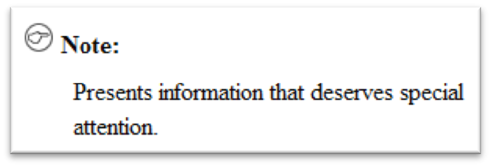
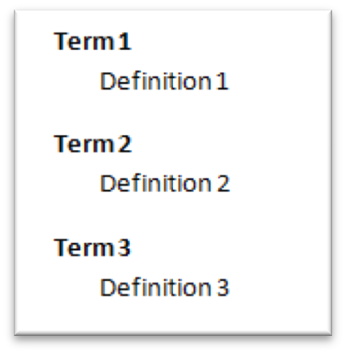

**Inline elements**
- Used within block elements
- Label words or phrases semantically
- May be related to a subject area or domain
  - User interface
  - Programming
  - Software
  - Highlighting

  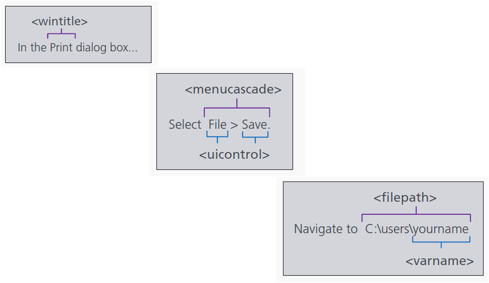

**Maps and bookmap structure**
  - Define the sequence and hierarchy of your topics in a final deliverable
  - Define the relationships between topics throughout the deliverable
  - Serve as outlines or tables of contents for DITA deliverables
  
**Standard metadata attributes and values** to select, filter, and flag content at any of the following levels:
  - Bookmap
  - Map
  - Topic
  - Elements
    
**Reuse mechanisms allowing you to:**
  - Reuse entire maps or topics
  - Reuse common content units
  - Create variables text
  - Profile differences (set conditions)
    
**Transforms and style standards** to produce a variety of output types
  - PDF
  - HTML
  - Various help systems (webhelp, chm, htmlhelp, javahelp, eclipsehelp)
  - ePUB
  - RTF
  - SCORM
    
**Constraint capabilities** that allow us to simplify authoring and enforce rules

*Strict task is a constraint of General task*
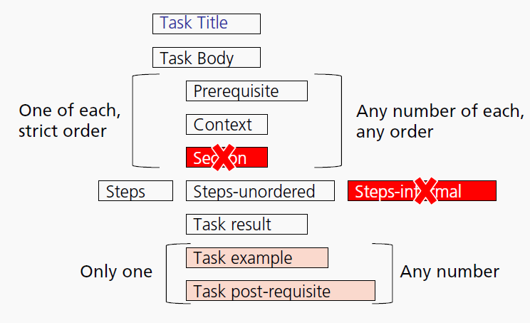

**Specialization capabilities** that allow us to create new information types and domain-specific elements to meet our organizational and industry needs

*Learning and training specialization*
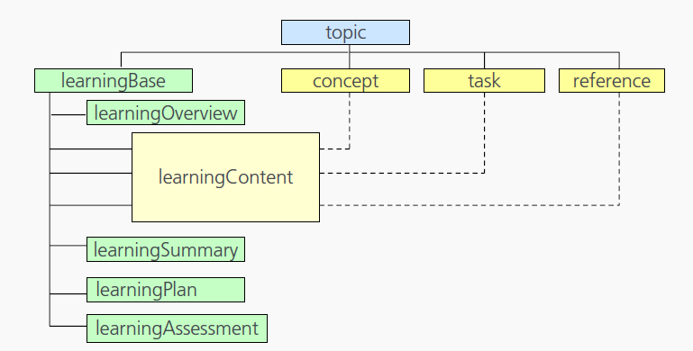
## What is metadata?
  - Data about data
  - Slots or buckets in which to place your content
  - Assists users in locating information in multi-faceted searches
  - Assists authors in locating existing information
  - Assists authors in assembling content into multiple deliverables
### DITA core metadata
Subset of Dublin Core Metadata Initiative
  - Audience
  - Author
  - Category
  - Copyright
  - Critdates
  - Permissions
  - ProdInfo
  - Publisher
  - Source

## For more information, See 

---
---
# Creating DITA topics

## Structure of a DITA topic

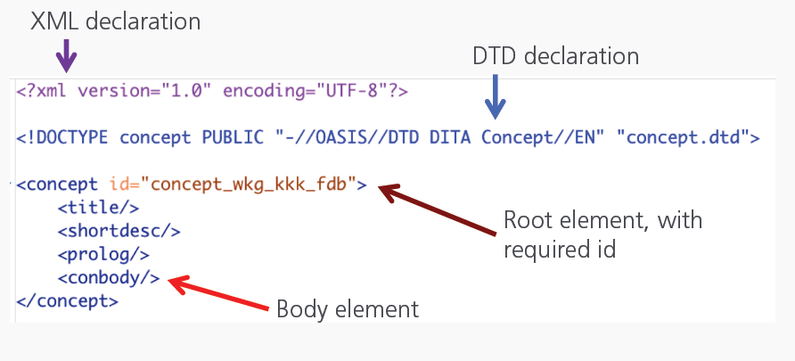

- An XML document always starts with a “root” element
```
<concept>…</concept>
```
-  All other elements are nested elements inside the root element
```
<concept>

  <title>…</title>

</concept>
```

## DITA information types

| Information type | Purpose |
| --- | ----- |
| Task | Provide step-by-step instructions that enable users to perform tasks and reach their goals |
| Concept | Support the knowledge needed to perform tasks successfully |y
| Reference | Provide the data required to enable task performance |
| Troubleshooting | Provide instructions for locating and resolving problems |
| Glossary | Provide definition of terms |

## Structure of a DITA topic

- All elements consist of an open tag, a close tag, and content or another nested element

```
<steps>
 <step>
 <cmd>Attach the lens. </cmd>
 <info>Keeping the mounting index on the lens aligned with the mounting index on the camera body, position the lens in the camera’s bayonet mount. </info>
 </step>
…
</steps> 
```

- Every open tag must have an close tag

```<title> … </title>```

- …except “empty” elements
```

<image href=“lens.jpg”/>
<p/> = <p></p> 
```

- Nested elements must be fully contained inside the parent element

**CORRECT**

```<taskbody>
<context>…</context>
<steps>
<step>
<cmd>…</cmd>
</step>
</steps>
</taskbody>
```

**INCORRECT**

```<ul>
<li>…</li>
<li>
<ul>
<li>…</li>
<li>…</li>
</li>
</ul>
</ul>
```

- Additional information about elements may be provided in attributes
  - Available attributes differ depending on the elementc
  - Always consist of a name and a value (the value is in quotes)

  ```
  <image href=“BayonetMount.jpg”/>
  <note type=“warning”> 
  ```
- Architectural definition files specify which are required and in what order for each information type

  - Some elements are common to all information types
  - Some elements are unique to a specific information type

